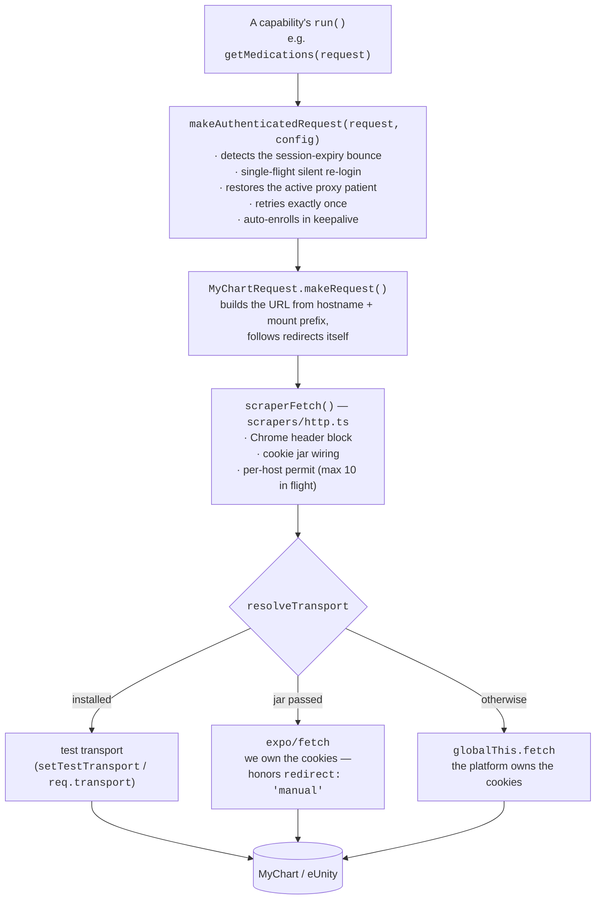
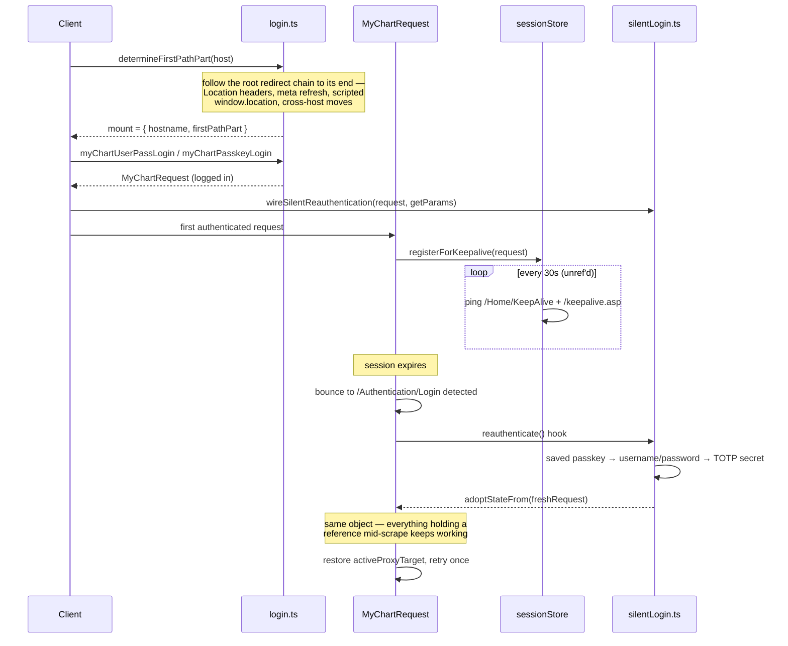
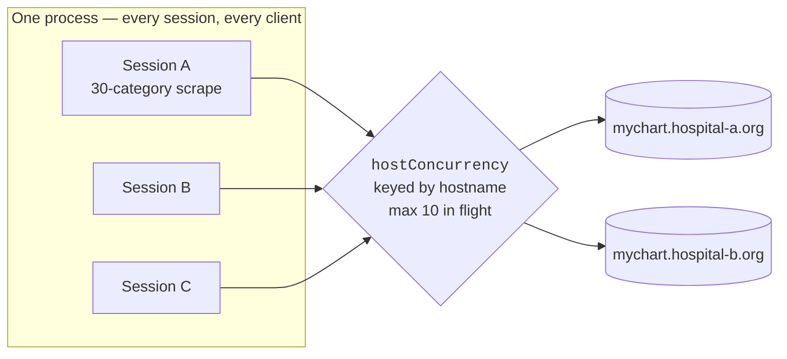
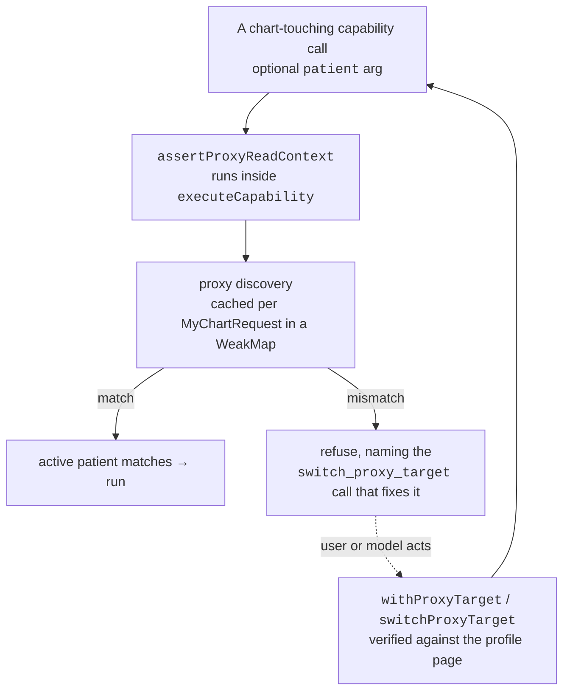
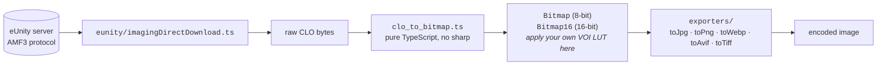

# 01 — Shared core (`scrapers/`, `shared/`)

Every client runs this code. It has no knowledge of MCP, React Native, or `argv`.

## Layout

```
scrapers/
  http.ts                      the ONE outbound path — headers, cookie jar, per-host permit
  cookies.ts                   cookie jar
  myChart/
    myChartRequest.ts          session object: hostname, mount prefix, cookies, redirects
    login.ts                   mount discovery + username/password + 2FA + passkey login
    makeAuthenticatedRequest.ts every post-login call goes through here
    silentLogin.ts             non-interactive re-login ladder
    sessionStore.ts            keepalive heartbeats
    proxyContext.ts            multi-patient (proxy) switching primitives
    proxyTools.ts              thin client layer over proxyContext
    <category>.ts              medications, allergies, vitals, immunizations, …
    visits/ messages/ bills/ notes/ labs_and_procedure_results/ other_mycharts/
    eunity/                    imaging download over the eUnity/AMF3 protocol
    clo-image-parser/          CLO decoder + per-format exporters
  list-all-mycharts/           directory of ~750 instances, mount-discovery probe
shared/
  capabilities.ts              the capability registry (see 02)
  hostConcurrency.ts           per-host request permit
  resolveUnique.ts             name → object lookup
  base64url.ts  logger.ts  telemetry.ts  accounts.ts  env.ts  updateCheck.ts
read-local-passwords/          Chrome/Arc/Firefox password store extraction (CLI only)
```

## The request stack



Three things about this diagram are load-bearing:

- **`makeAuthenticatedRequest` is not optional.** Raw `makeRequest` remains the transport
  for the pre-login world only — mount discovery, `DoLogin`, 2FA, terms, keepalive pings.
  That split is also what makes renewal deadlock-free: the renewal path itself only issues
  raw or `autoRenew: false` calls.
- **There is no injected `fetch`.** Which networking call to make is a fact about the
  runtime, not about the caller, so `resolveTransport` decides. Substituting a different
  stack when the platform owns the cookies sends every request out with no session.
- **The per-host permit wraps the individual fetch, never the redirect recursion.**
  `makeRequest` calls itself to follow redirects; holding a permit across that would let
  one chain hold several at once and deadlock against its own callers.

## Session lifecycle



`getParams` runs *at renewal time*, not at wiring time, so credential stores are re-read
fresh. If nothing on the ladder can run without a human, the wrapper throws a typed
`SessionExpiredError` rather than blocking.

A heartbeat that finds the session dead renews proactively through the same hook before
marking the session expired.

## Rate limiting



The far end counts connections, not accounts, so the limiter is process-wide and keyed by
the host actually being contacted (a cross-host redirect gets its own budget instead of
spending the vanity hostname's). A full 30-category scrape otherwise fans out ~60
simultaneous requests at one hospital, which is how an instance ends up in
`blockedInstances.ts`. Override with `MYCHART_MAX_CONCURRENT_REQUESTS_PER_HOST`.

## Multi-patient (proxy) access

MyChart's active patient is **server-side session state** — there is no per-request patient
parameter. Callers must therefore name the patient they mean rather than relying on a
previous switch.



Omitting `patient` means the account holder, explicitly. The `Patients` group and the
`account`-kind capabilities are exempt — guarding "you must already be on patient X" in
front of the tools that list and change X would make them unusable exactly when needed.

The discovery cache is keyed on the `MyChartRequest` object, so a re-login (keepalive
reconnect, process restart) can never inherit stale knowledge, and parallel reads share one
discovery.

## Imaging

The only capability whose payload isn't JSON. Getting an image out is deliberately two
steps, with **no one-shot helper** — the format is the exporter you call, never inferred
from a filename.



## Test seams

There is no `fetchFn` option anywhere. Testing uses two seams, both sitting *below* the
headers, the jar and the permit, so a test still exercises the request production would
send:

| Seam | Scope | Used by |
| --- | --- | --- |
| `setTestTransport(fn)` | process-wide — **clear it in `afterEach`** | `loginFlow.unit.test.ts` |
| `req.transport = fn` | one session; null in production | `__tests__/mockMyChartRequest.ts` |

Anything wrapping `req.transport` must call `platformFetch`, not the old value — binding
the old value once broke the whole 750-host mount-discovery sweep and nothing else caught
it, which is why `probeMountDiscovery.unit.test.ts` exists.
