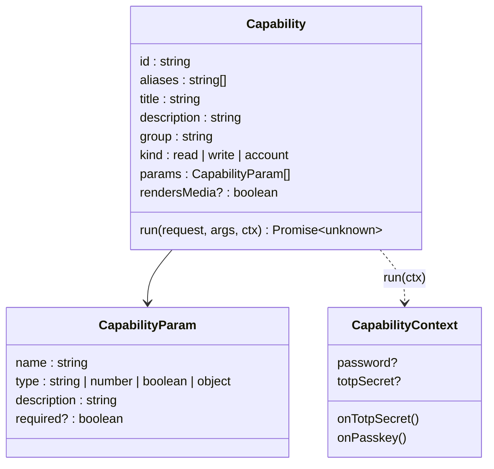
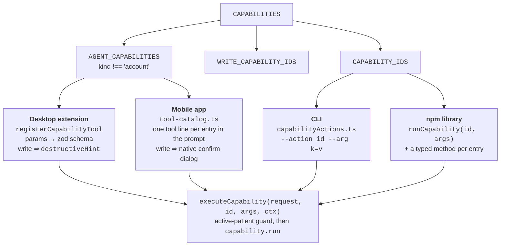
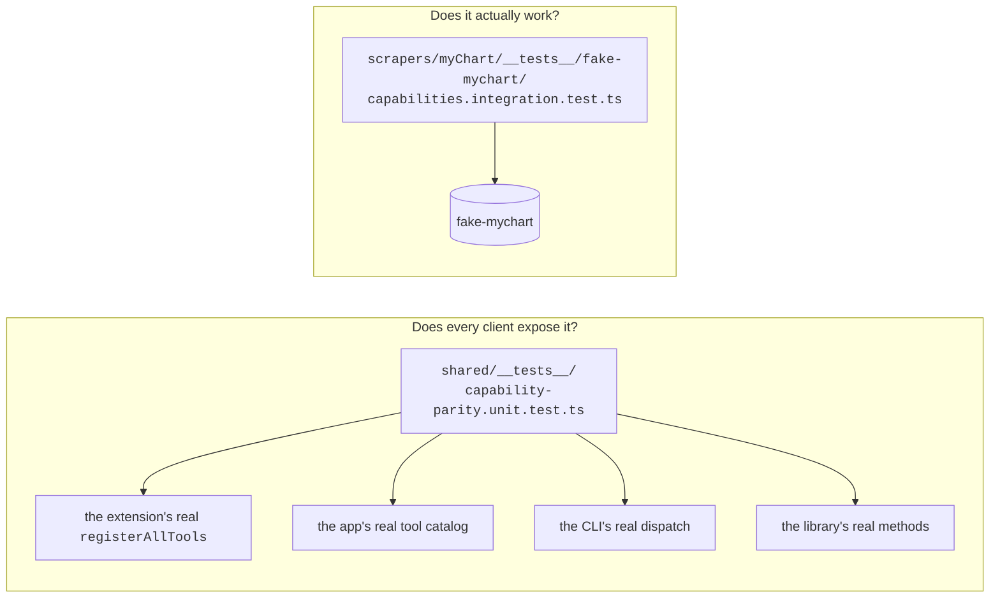
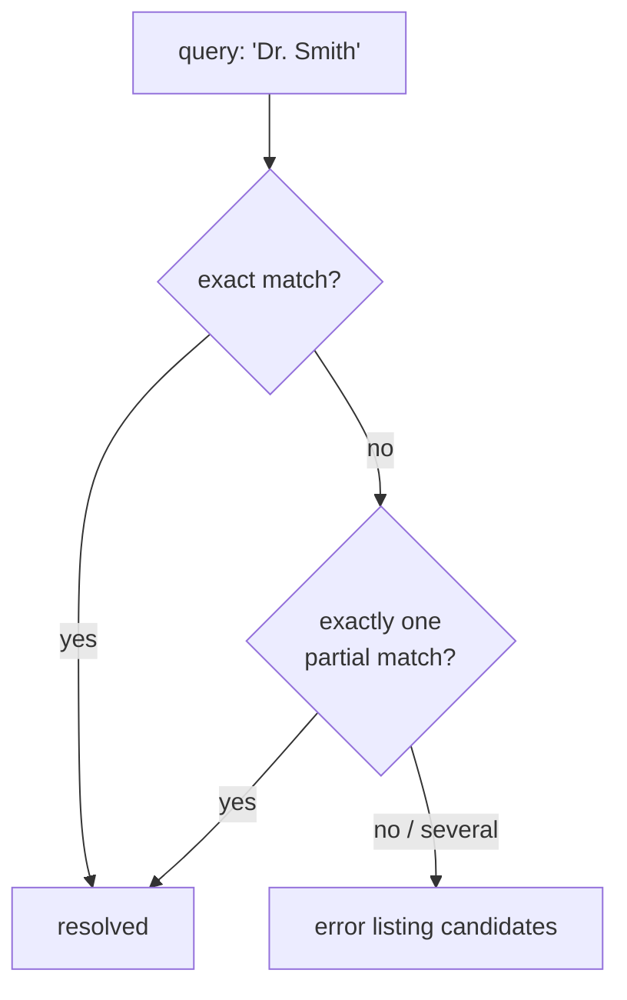

# 02 — Capability registry (`shared/capabilities.ts`)

The single source of truth for what OpenRecord can do with a MyChart account. **Adding an
entry here is all it takes to ship the capability in every client.**

This file exists because four hand-maintained tool lists had drifted to 46 / 43 / 46 / 38
entries, which meant a patient's answer depended on which client they happened to ask.

## Shape of an entry



`run()` takes a logged-in `MyChartRequest` and returns JSON-serializable data. Nothing in
here knows about MCP, React Native, or argv — the clients own their own presentation, and
only their presentation.

`CapabilityContext` carries the per-account state that isn't on the MyChart session: the
stored password, the saved TOTP secret, and the callbacks that persist new ones. Each
client wires it to its own credential store; the registry never knows where credentials
live.

## Fan-out to the clients



The `account`-kind entries are filtered out of `AGENT_CAPABILITIES`: **no client offers
them to a model.** The CLI drives them from flags, the mobile app from its settings screen
(`executeAccountCapability`), the extension not at all.

## What `kind` decides

| `kind` | Meaning | Extension | Mobile app | CLI |
| --- | --- | --- | --- | --- |
| `read` | Reads chart data | plain tool, batchable | batchable, no confirmation | `--action` |
| `write` | Mutates the chart | `destructiveHint` annotation | exclusive tool + native confirm popup | `--action` |
| `account` | Changes how the patient signs in | not registered | settings screen only | dedicated flags |

At time of writing the registry holds 51 entries — 38 `read`, 8 `write`, 5 `account` —
across ten groups (Profile, Prescriptions, Results, Visits, Messages, Billing, Care,
Emergency contacts, Patients, Account security). Don't trust that count; run:

```bash
bun run cli --list-capabilities
```

## The parity tests

Two tests keep the fan-out honest, and they check different things:



The parity test reads each client's *real* surface, not a declaration of it, and also fails
if a hardcoded capability-id check reappears where `rendersMedia` should be used, or if the
account-parameter spelling drifts between clients.

## Shared conventions the registry owns

Three things live here rather than in a client, because putting them in one client means
the other three get them wrong:

**The account selector.** `ACCOUNT_PARAM` is the one parameter every capability takes in
every client. It was the last one still hand-written per client (`account` in the
extension, `instance` in the mobile app). Both now emit `account`; `readAccountArg` still
accepts `instance` for the mobile app's alert cards and saved chats.

**Fuzzy name resolution.** `send_message` takes a provider *name* and `request_refill` a
medication *name*. Both resolve against the live list via `shared/resolveUnique.ts` and
**refuse to guess when a name is ambiguous**, listing the candidates instead.



Exact match runs first for a reason: a substring-only matcher rejects a perfectly correct
name whenever another entry contains it ("Dr. Smith" against "Dr. Smithson"), telling the
caller to be more specific about a name that could not have been.

`resolveTopic` is the deliberate exception — an unmatched message topic falls back to the
first one, because MyChart requires a topic and the category is cosmetic. `send_message`
returns `topic_used` and `topic_substituted` so the substitution is never silent.

**The portable base64url codec** (`shared/base64url.ts`) behind `image_id`: no `Buffer`, no
`atob`, because the token round-trips through Hermes. Tested against Node's `Buffer` as the
oracle, since a token minted by one client has to decode in every other.
