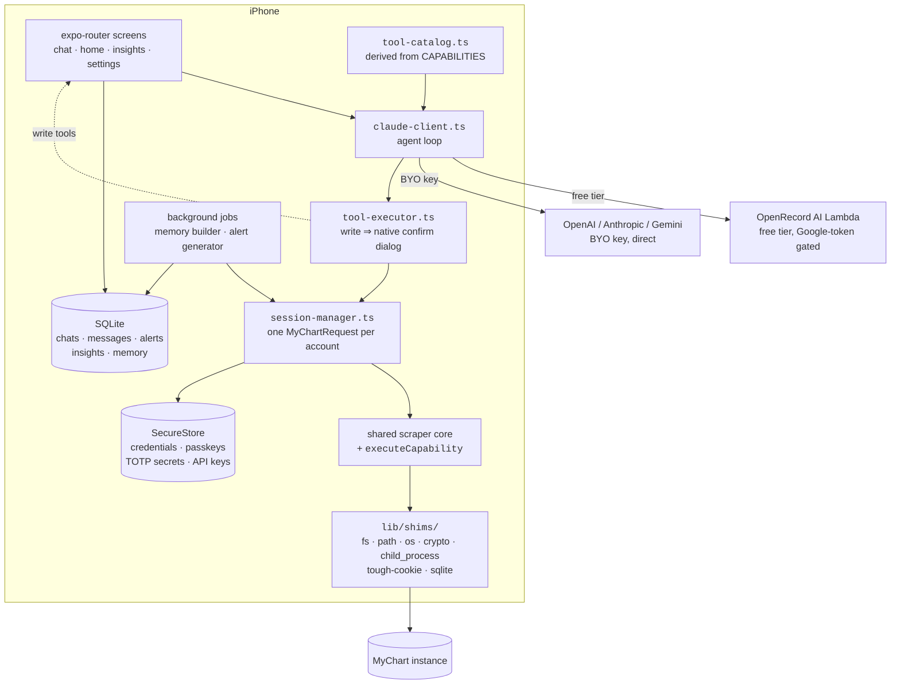
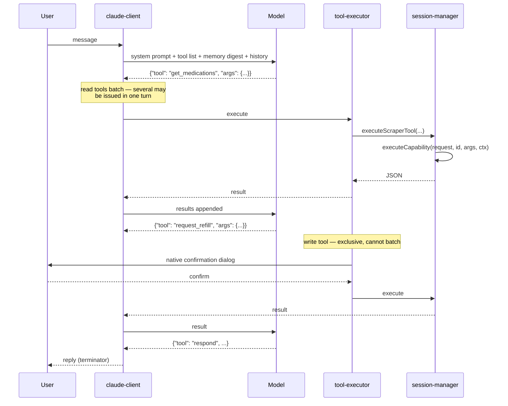
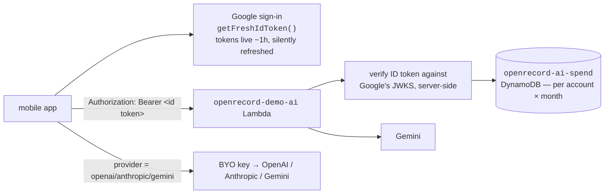
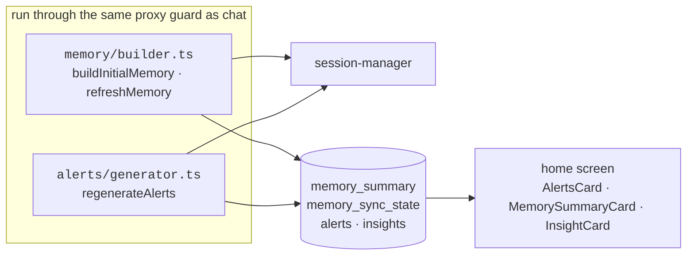

# 03 — Mobile app (`expo-app/`)

An Expo / React Native iOS app that runs the scrapers **on device** and drives them with an
agent loop. Nothing about the patient's chart leaves the phone except what the user's chosen
model provider sees.

Build: `bunx expo run:ios`.

## Layout

```
expo-app/src/
  app/                          expo-router routes
    onboarding/steps/           welcome → google → picker → mychart → twofa → passkey
    (auth)/
      index.tsx                 home: alerts, insights, chat list
      chat/[id].tsx             a conversation
      insights.tsx
      settings/                 index.tsx, ai.tsx
  components/                   AlertsCard, ChatBubble, ChatInput, InsightCard,
                                LeftDrawer, MemorySummaryCard, SkillsSheet
  lib/
    ai/
      claude-client.ts          the agent loop
      tool-catalog.ts           tools, derived from the capability registry
      tool-call-parser.ts       extracts {"tool":…,"args":…} from model output
      tool-executor.ts          confirmation gating, then dispatch
      title-generator.ts
    scrapers/session-manager.ts connect / 2FA / passkey / dispatch every capability
    storage/
      database.ts               SQLite: chats, messages, alerts, insights,
                                memory_summary, memory_sync_state
      secure-store.ts           MyChart accounts, API keys, model + provider choice
    backend/                    Google sign-in, backend session, AI Lambda client
    memory/                     background digest builder
    alerts/                     background alert generator
    imaging/                    CLO → JPEG on device, attachment store
    skills/                     skill playbooks
    shims/                      Node-API shims so the scrapers run under Hermes
```

## Runtime shape



The shims are what let unmodified scraper code run under Hermes — the scrapers import
`fs`, `path`, `crypto` and friends, and Metro resolves those to the shim implementations.
`http.ts`'s `PLATFORM_OWNS_COOKIES` check (two signals: `navigator.product` and whether
`expo/fetch` resolved) is the other half of that story; getting it wrong on device is a
silently broken session, not a crash.

## The agent loop

`claude-client.ts` is the reference implementation of the loop — the browser demo in
`openrecord-splash/demo/src/agent.ts` is a faithful port of it, deliberately kept in step.



Protocol details worth knowing: tool calls are JSON objects in the model's text output
(`tool-call-parser.ts` extracts them), `respond` is the terminator, read tools batch and
write tools are exclusive, and `isExclusiveTool` is the gate.

## AI providers and the free tier

**AI requires Google sign-in — all providers, BYO keys included.** Signing in is what
unlocks the $50/month included credit.



The client is never trusted about identity — the Lambda verifies the token itself
(signature, issuer, audience, expiry). A 401 means the app silently re-signs-in and
retries; over the spend cap returns 402. Endpoint is `backendUrl` in
`expo-app/app.config.ts`, override with `EXPO_PUBLIC_BACKEND_URL`.

Everything else — the chart data, the scraping, the SQLite database, the credentials —
lives on device.

## Background jobs



Because these run through `assertProxyReadContext` like everything else, they fail safe
rather than mixing a family member's data into the account holder's caches.

## Testability

Every interactive element carries a `testID` (and an `accessibilityLabel`), enforced in CI
by `expo-app/src/__tests__/testids.unit.test.ts`, which scans every `.tsx` under
`src/app` and `src/components`. `tool-catalog.ts` is deliberately kept free of React Native
imports so the parity and catalog tests can import it in plain Bun.

UI automation goes through `maestro-cli` against a session-dedicated simulator — see the
root `CLAUDE.md` for the recipe.
