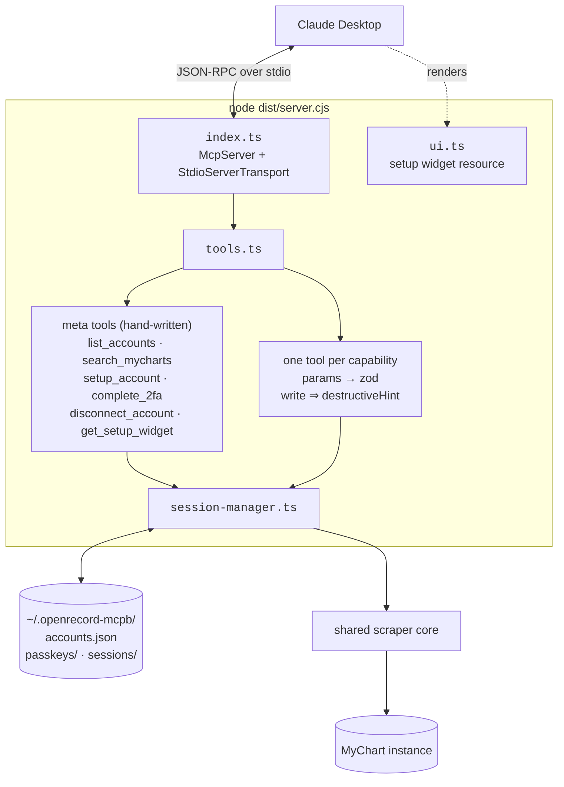
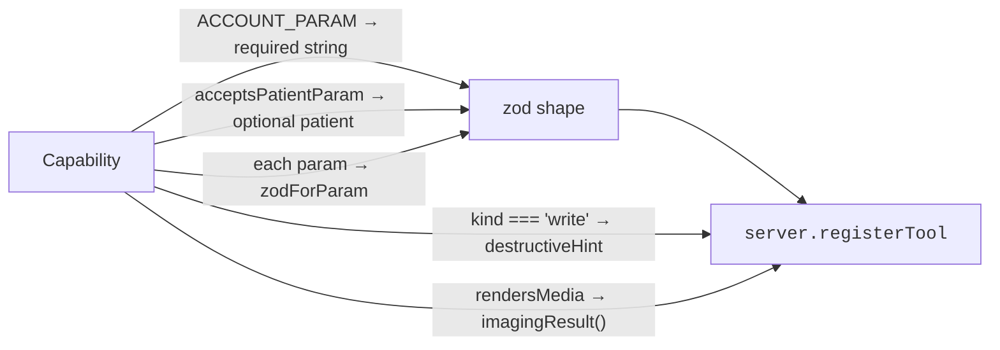
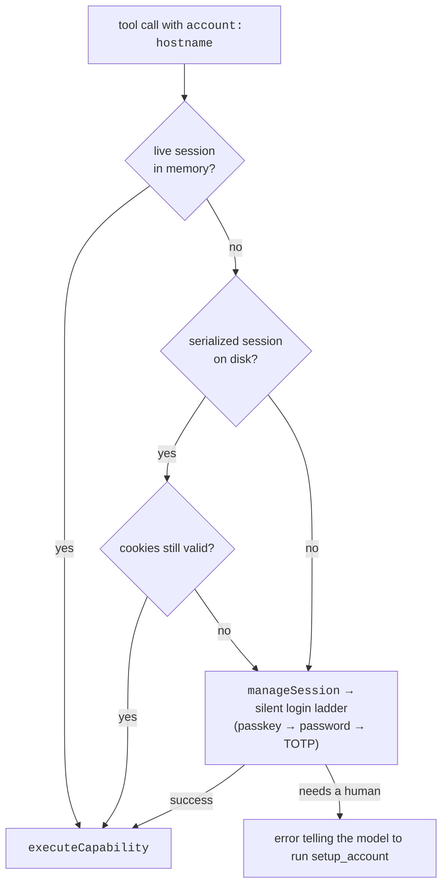
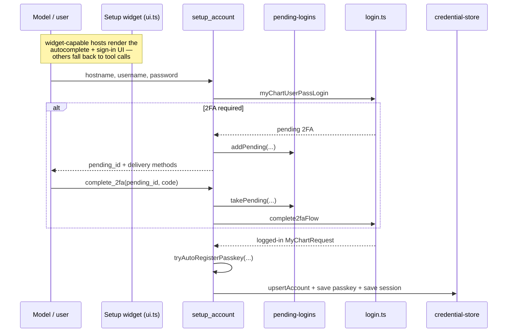

# 04 — Claude Desktop extension (`claude-desktop-extension/`)

A `.mcpb` Claude Desktop Extension that runs the scrapers locally as a stdio MCP server.
Claude Desktop launches it as `node dist/server.cjs`; it speaks the 2025-06-18 MCP protocol
(so it can use elicitation).

Build: `cd claude-desktop-extension && bun run pack` → `dist/server.cjs` + `openrecord.mcpb`.

## Layout

```
claude-desktop-extension/
  manifest.json          MCPB manifest
  src/
    index.ts             entry point — logger routing, McpServer, stdio transport
    tools.ts             registerAllTools: meta tools + one tool per capability
    ui.ts                interactive setup widget (HTML resource)
    session-manager.ts   hostname → live MyChartRequest, silent re-login
    credential-store.ts  ~/.openrecord-mcpb/ — accounts, passkeys, sessions
    instances.ts         bundled MyChart directory + search
    pending-logins.ts    2FA continuations between tool calls
    imaging/download-study.ts  CLO → JPEG via the shared pure-JS exporter
```

## Runtime shape



**stdout is JSON-RPC and nothing else.** `index.ts` routes the scraper logger singleton to
stderr *before importing any scraper module* — a stray `console.log` corrupts the framing
and Claude Desktop reports "Unexpected token X is not valid JSON".

## Which tools are hand-written, and why

`registerAllTools` hand-writes only the six account-management meta tools — `list_accounts`,
`search_mycharts`, `setup_account`, `complete_2fa`, `disconnect_account`, and
`get_setup_widget`, which hands back the setup UI resource for hosts that render it. They
manage credentials **on this machine** and have no counterpart in the other clients — the CLI
has flags and a local password store, the mobile app has a settings screen. Everything else is
one MCP tool per registry entry, translated to zod:



The loop is over `CAPABILITIES`, not `AGENT_CAPABILITIES` — **this client does register the
`account`-kind entries**, unlike the mobile app, which withholds them from its prompt. Claude
Desktop is where a person deliberately sets an account up, so passkey and authenticator setup
belong on the tool list here.

## Session resolution

Every capability tool starts the same way: `resolveSession(account)`.



This is why the server's instructions tell the model that `sessionActive: false` means "no
live in-memory session", **not** "this account needs reconfiguring": if `list_accounts`
returns an entry, the account is set up and the server will silently re-authenticate.

## Setup flow



Auto-registering a passkey at setup time is what makes every later session silently
renewable without storing anything the user has to re-enter.

A built-in **Springfield General Hospital (test)** instance points at
`fake-mychart.fanpierlabs.com`, so the extension is demoable without a real account.

## Imaging

`imaging/download-study.ts` calls `convertCloToJpgPureJs`
(`scrapers/myChart/clo-image-parser/exporters/to_jpg_purejs.ts`) — the same shared exporter the
mobile app uses. The extension used to carry its own `jpeg-encoder.ts` and `voi-lut.ts`; those
are gone, so the two `sharp`-less clients now produce identical bytes from identical code
rather than two encoders that could drift.

## Testing

`src/__tests__/memfs.ts` is an in-memory `fs` shim — import it **before** the store and the
tests touch no disk. It intercepts only paths under `~/.openrecord-mcpb` and delegates
everything else to the real `fs`, because `bun test` runs the package's files in one
process and the imaging suites read real fixtures. Do not redirect `$HOME` instead: Bun's
`os.homedir()` does not follow it, so you would silently be pointed at the developer's real
credentials.

`bun run test` at the repo root **needs `cd claude-desktop-extension && bun install`
first** — the capability-parity test imports this package's real `registerAllTools`, so it
needs `zod` and the MCP SDK from here.
