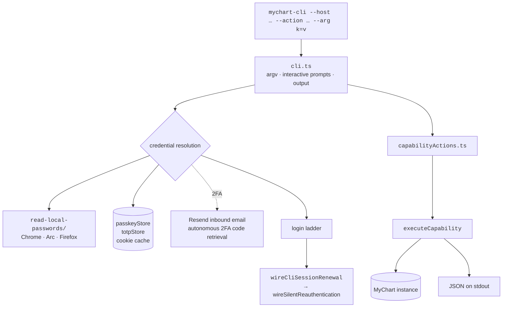
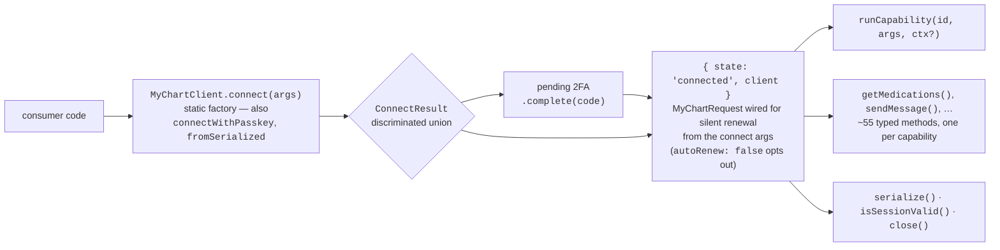
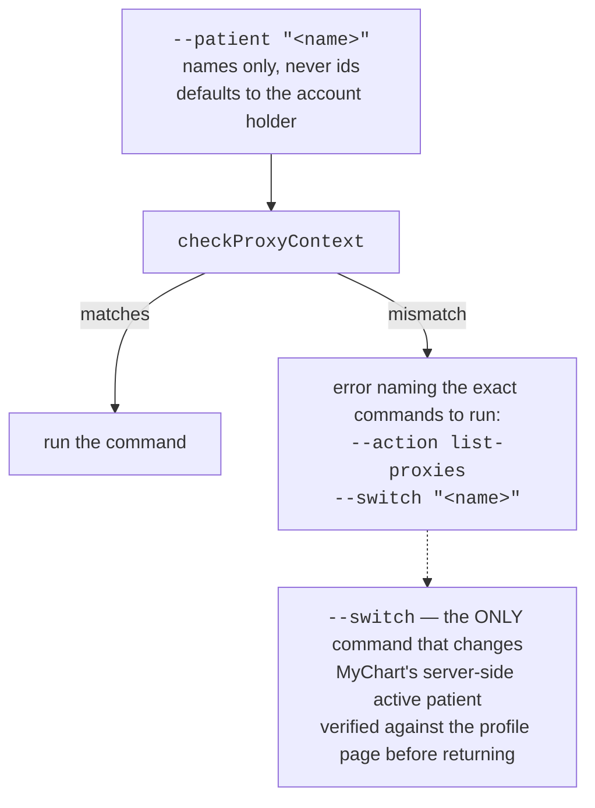

# 05 — CLI and npm package (`npm-package/`)

One package, two products: the `mychart-cli` binary and an importable library. Both are
built from the same source tree with tsup.

Build: `cd npm-package && bun run build` → `npm-package/dist/cli.cjs`.
Install: `npm i -g mychart-cli`.

## Layout

```
npm-package/
  cli/
    entry.ts             bin shim — splices argv, then dynamically imports cli.ts
    cli.ts               argv parsing, interactive prompts, output; exports runCli()
    capabilityActions.ts the CLI's only dispatch surface — generic, registry-driven
    help.ts              renders --help, flags then the capability listing
    totpStore.ts         saved TOTP secrets
    passkeyStore.ts      saved passkey credentials
  src/
    client.ts            MyChartClient
    index.ts             public exports
  examples/
  docs.md
read-local-passwords/    Chrome / Arc / Firefox password store extraction (repo root)
```

**The CLI has no hand-written per-action code left worth the name.** `capabilityActions.ts`
resolves `--action` through `resolveCliAction` (plus `CLI_ACTION_ALIASES`, the four surviving
dashed spellings — `list-proxies`, `get-thread`, `delete-message`, `request-refill`) and runs
it through one generic `runCapabilityAction`. Even `FULL_SCRAPE_CAPABILITIES` is derived by
predicate — read-kind, not `rendersMedia`, accepts a patient, no required params — rather than
hand-listed. Four cases still branch in `cli.ts`, and each earns it: `send-message`,
`send-reply` and `keep-alive-test` are interactive, and `get-imaging` is a *composite* that
chains `get_imaging_results` into one `download_imaging_study` per study — both hops through
`executeCapability`, replacing a 220-line handler that fetched around the active-patient guard
entirely.

`capabilityActions.ts` and `help.ts` sit outside `cli.ts` so the parity test and the CLI's own
unit tests can drive them without dragging in the login flow and argv parsing. Note that
importing `cli.ts` **no longer runs the CLI** — it ends in `export async function runCli()`
behind an `if (import.meta.main)` guard, which is what lets tests reach its internals.

## Runtime shape



`--list-capabilities` prints every capability and the arguments it takes; `--action <id>`
with repeated `--arg name=value` runs any of them.

## The library



`connect` is a static factory rather than a constructor + method because a connection can
legitimately end up half-made: it returns a union whose pending-2FA arm carries the
`complete(code)` continuation, so there is no window in which you hold a `MyChartClient` that
is not actually connected.

The typed methods and `runCapability` route to the same registry entries, so they cannot
disagree about what a capability does.

## Proxy semantics — the CLI sets the convention

The CLI is deliberately conservative, and the other clients follow its semantics:
**reads never mutate.**



A switch that lands on a different patient fails instead of returning the wrong chart.
Record ids are opaque and organization-specific, so switch tools accept `self: true` to
return to the account holder rather than requiring a looked-up id.

## Imaging in the CLI

The CLI is the one client that has `sharp` available, so it uses the full exporter set:

```
CLO bytes → convertCloToBitmap → convertBitmapToJpg / …
```

`dev-scripts/clo-to-jpg.ts` wires the two steps together for terminal use. Note there is no
one-shot `convertCloToJpg` wrapper — it used to infer the format from the filename and
wrote JPEG bytes into `out.png`.

## Notable flags

| Flag | Does |
| --- | --- |
| `--host <hostname>` | which MyChart instance |
| `--action <id> --arg k=v` | run any capability from the registry |
| `--list-capabilities` | print every capability and its arguments |
| `--patient "<name>"` | assert who the command is about |
| `--switch "<name>"` | change the active patient (the only mutating proxy command) |

Full reference: [`docs/cli.md`](../cli.md) — cookie caching, credential resolution, 2FA.
TOTP specifics: [`docs/mychart-totp.md`](../mychart-totp.md).

## Build-order gotcha

`cd npm-package && bun run typecheck` needs `bun run build` first — its integration test
imports the built `dist/` bundle on purpose, so that what ships is what's tested.
`tests/integration/ci/cli-passkey.integration.test.ts` likewise spawns the built
`dist/cli.cjs`.
