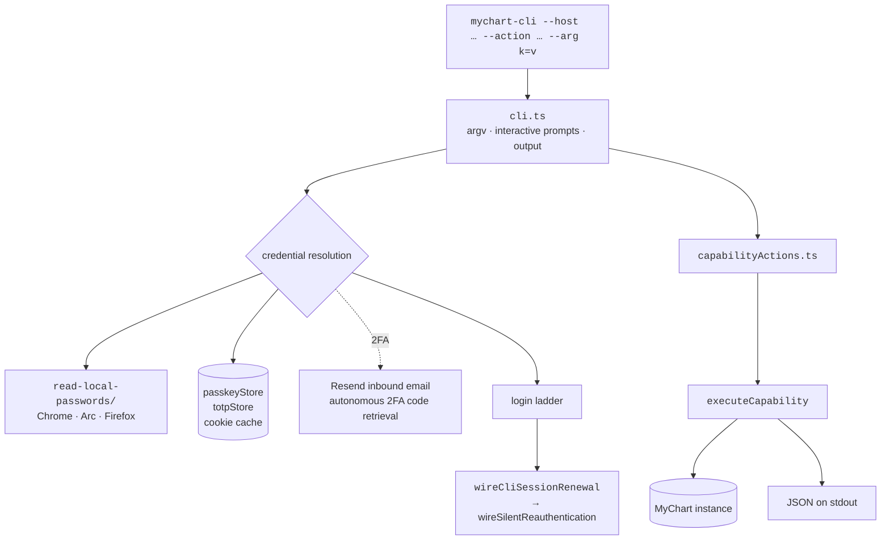
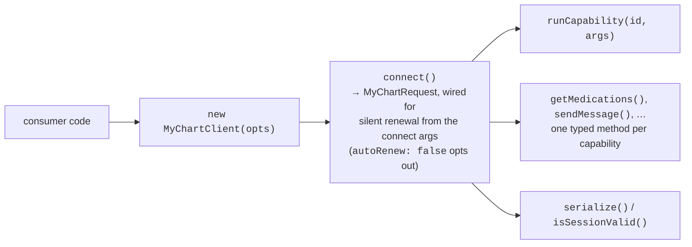
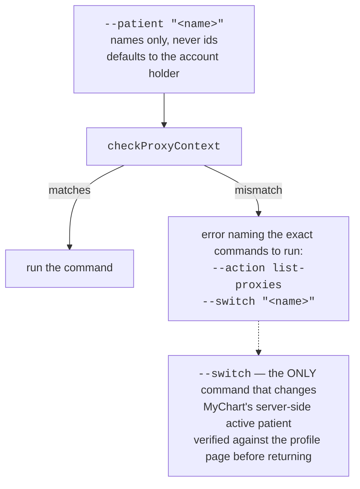

# 05 — CLI and npm package (`npm-package/`)

One package, two products: the `mychart-cli` binary and an importable library. Both are
built from the same source tree with tsup.

Build: `cd npm-package && bun run build` → `npm-package/dist/cli.cjs`.
Install: `npm i -g mychart-cli`.

## Layout

```
npm-package/
  cli/
    entry.ts             bin shim
    cli.ts               argv parsing, interactive prompts, output — runs main() on import
    capabilityActions.ts --action dispatch, kept OUT of cli.ts
    totpStore.ts         saved TOTP secrets
    passkeyStore.ts      saved passkey credentials
  src/
    client.ts            MyChartClient
    index.ts             public exports
  examples/
  docs.md
read-local-passwords/    Chrome / Arc / Firefox password store extraction
```

`capabilityActions.ts` is separate from `cli.ts` for a specific reason: `cli.ts` runs
`main()` the moment it is imported, and the parity test has to import the dispatch.

## Runtime shape



`--list-capabilities` prints every capability and the arguments it takes; `--action <id>`
with repeated `--arg name=value` runs any of them.

## The library



The typed methods and `runCapability` route to the same registry entries, so they cannot
disagree about what a capability does.

## Proxy semantics — the CLI sets the convention

The CLI is deliberately conservative, and the other clients follow its semantics:
**reads never mutate.**



A switch that lands on a different patient fails instead of returning the wrong chart.
Record ids are opaque and organization-specific, so switch tools accept `self: true` to
return to the account holder rather than requiring a looked-up id.

## Imaging in the CLI

The CLI is the one client that has `sharp` available, so it uses the full exporter set:

```
CLO bytes → convertCloToBitmap → convertBitmapToJpg / …
```

`dev-scripts/clo-to-jpg.ts` wires the two steps together for terminal use. Note there is no
one-shot `convertCloToJpg` wrapper — it used to infer the format from the filename and
wrote JPEG bytes into `out.png`.

## Notable flags

| Flag | Does |
| --- | --- |
| `--host <hostname>` | which MyChart instance |
| `--action <id> --arg k=v` | run any capability from the registry |
| `--list-capabilities` | print every capability and its arguments |
| `--patient "<name>"` | assert who the command is about |
| `--switch "<name>"` | change the active patient (the only mutating proxy command) |

Full reference: [`docs/cli.md`](../cli.md) — cookie caching, credential resolution, 2FA.
TOTP specifics: [`docs/mychart-totp.md`](../mychart-totp.md).

## Build-order gotcha

`cd npm-package && bun run typecheck` needs `bun run build` first — its integration test
imports the built `dist/` bundle on purpose, so that what ships is what's tested.
`tests/integration/ci/cli-passkey.integration.test.ts` likewise spawns the built
`dist/cli.cjs`.
