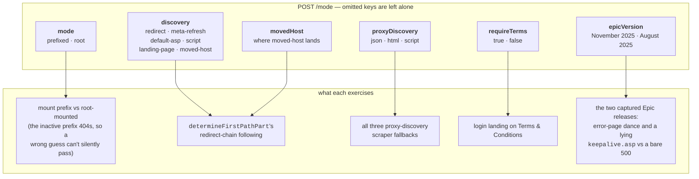
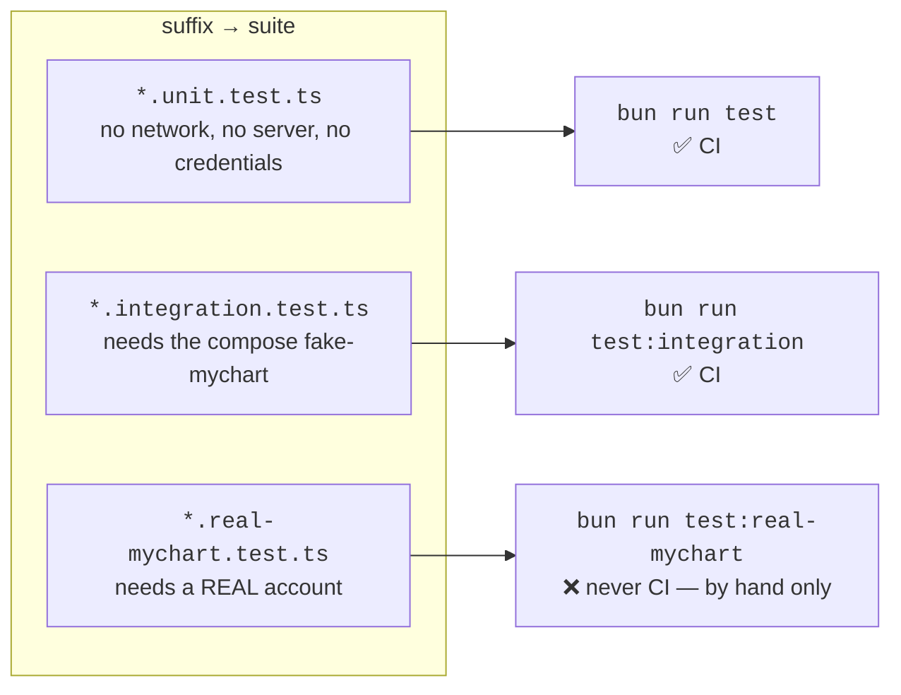
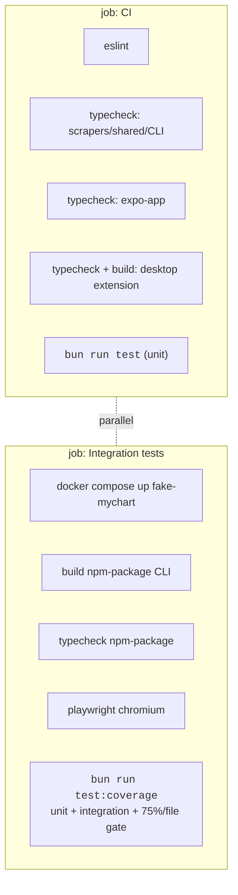
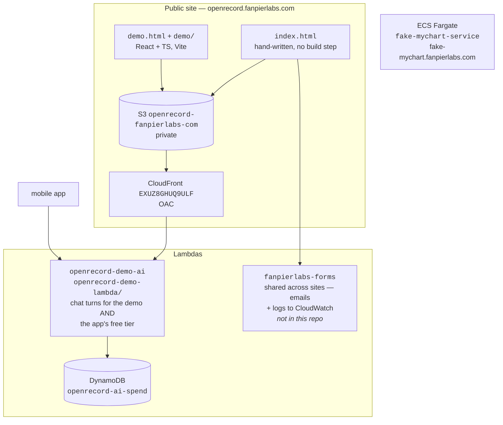

# 06 — Supporting services, testing, CI

Everything that isn't a client or the scraper core: the fake MyChart server, the Lambdas,
the public site, and how the test suites are wired.

## Fake MyChart (`fake-mychart/`)

A standalone Next.js app that mimics MyChart's API surface with Homer Simpson fake data.
It backs local development, every integration suite, and the extension's built-in
"Springfield General Hospital (test)" instance.

```bash
cd fake-mychart && bun run dev            # random port in 4000-5000, printed at startup
cd fake-mychart && PORT=4000 bun run dev   # pin it — anything defaulting to localhost:4000
```

The port is random by default so parallel worktrees don't collide; the CI compose service
serves 4000.

**Fidelity rule: the fake must behave EXACTLY like real MyChart.** It's a faithful
stand-in, not a convenience mock — response shapes, field casing, pagination
(`HasMoreData` / `SerializedIndex`), status codes, and server-side enforcement (WebAuthn
signature-counter monotonicity, session expiry on every post-login route) all match what
was observed on a real instance. Never simplify a contract to make a test easier.

Two mechanisms hold that line rather than leaving it to discipline. Response shapes are
conformed to skeletons generated from live captures (`src/data/realShapes.ts` +
`conformToShape`), so a field that drifts in casing or disappears fails here. And **every
`/api/*` POST requires a CSRF token** — the route rejects a missing
`__requestverificationtoken` header *before* it checks the session, the way real MyChart does;
`src/lib/html.ts` injects the token and its inline fetch shim attaches the header.

The point of the fake is that discovery and auth have many real-world shapes, and each one
has broken the scraper at some point. The knobs reproduce them:



`epicVersion` is the knob that keeps the scraper honest across releases. On **November 2025**
a failed call goes through the ASP.NET redirect dance (`/Home/FourOhFour` or `/Home/FiveHundred`
→ `/Home/Error?code=14` → a 200 page), `keepalive.asp` reports a live session even when it
isn't, and several per-result fields exist that didn't before. On **August 2025** the same call
is a bare 500 and keepalive is honest. `isLegacyEpicVersion()` selects the older behavior;
November 2025 is the default.

| Endpoint | Does |
| --- | --- |
| `POST /mode` | set the knobs above |
| `GET`/`POST /reset` | wipe all in-memory state back to the seed |
| `POST /api/invalidate-sessions` | kill every session, to simulate mid-scrape expiry |

Accounts: `homer`/`donuts123` (no 2FA, proxy access to three children with distinct chart
data), `marge`/`donuts123` (TOTP, accepts the fixed code `123456` or a live code from the
seeded secret `JBSWY3DPEHPK3PXP`). `FAKE_MYCHART_ACCEPT_ANY=true` loosens credential
lookup — it deliberately does **not** bypass TOTP code validation, which is real RFC 6238
cryptography in `src/lib/totp.ts`.

Deployed at `fake-mychart.fanpierlabs.com` (own ALB + ECS service). All state is in RAM.

## Test suites

**A test file's *filename* decides which suite it belongs to, not its folder.** Every
`test*` script in every `package.json` selects on the suffix and nothing else.



Two consequences, both load-bearing:

- **The real-MyChart suite is out of CI by construction.** No workflow globs
  `.real-mychart`, and `tests/suite-naming.unit.test.ts` reads the workflow files and fails
  if one ever does.
- **A test file that forgets its suffix never runs**, and a suite that never runs is
  indistinguishable from one that passes. The same test walks the repo and fails on any
  unsuffixed `*.test.ts`. There are no exceptions and no allowlist — a suite that genuinely
  can't run belongs behind `it.skip`, where the reporter still counts it.

**Bun runs test files in directory-entry order, not alphabetically**, and that order
changes whenever a file is added or renamed. Everything sharing the fake-mychart server
must therefore reset it in its own `beforeAll` (`resetFakeMyChart`) — resetting on the way
*out* still leaves the first suite of a run trusting the previous `bun test`.

## CI



A second workflow, `android-smoke.yml`, sits apart from `checks.yml` so it can carry a
`paths:` filter on `expo-app/**`. Its `bundle` job runs on every PR touching the app —
`expo prebuild --platform android` then `expo export --platform android`, i.e. Metro plus
Hermes bytecode, and it has to stay in the low minutes. Its `emulator` job (Gradle release
build, API-34 AVD, `maestro test e2e/android-smoke.yaml`) is weekly cron and
`workflow_dispatch` only. `EXPO_PUBLIC_BACKEND_URL` is pinned workflow-wide to an unroutable
address so neither job can reach the real AI Lambda.

The coverage gate is a **mode** over the two CI kinds, not a fourth suite — measuring the
unit suite alone counts every scraper that's only covered end-to-end as untested, and the
integration suite alone does the reverse. It lives in the `integration` job because that's
the only one with the compose service, the built `dist/`, and every package's deps.

Three things to know before touching it:

- **The threshold is per file** (`bunfig.toml`, 75% lines and functions). No file hides
  behind a healthy average — and a file nobody has tested must be covered or waived.
- **The keys must be plural** — `lines`, `functions`, `statements`. Bun's own docs show
  `line`/`function`; those spellings are parsed and then silently ignored, leaving the gate
  reading as configured while enforcing nothing.
- **Only files a test imports are measured.** An orphaned module is *absent* from the
  report rather than counted as 0%, so it slips the gate by never being looked at.

`bunfig.toml` carries two kinds of exclusion, and the difference matters: non-product code
(fixtures, `fake-mychart/`, `dev-scripts/`, `dist/`) is out permanently, while everything
under **"Below the bar, waived for now"** is real product code that isn't tested yet.
Shortening that list is how the gate gets stronger.

Put run-it-yourself demos in `dev-scripts/`, never in an `if (import.meta.main)` block
inside a product module — such a block is unreachable from a test, so a few lines of demo
code drag an otherwise fully-covered file under the bar.

## AWS services



The splash's waitlist form POSTs `{ site, name, email }` to the **shared** `fanpierlabs-forms`
lambda — there is no `newsletter-lambda/` in this repo any more, and nothing here deploys that
endpoint. A hidden `company` honeypot field fakes success rather than sending.

**The demo is a complete OpenRecord session in the browser** against a fictional patient,
recreating *both* the iOS app and the desktop extension sharing one session — a refill
requested on the phone shows up in the desktop chat. Its agent loop
(`demo/src/agent.ts`) is a faithful port of `expo-app/src/lib/ai/claude-client.ts`: same
JSON tool-call protocol, read batching, exclusive write tools, `respond` terminator. Write
tools genuinely mutate session state.

Two deliberate non-features:

- **No canned-response path.** An earlier version fell back to a keyword table when no
  model was reachable and produced confident non sequiturs. A failed call now surfaces an
  honest error and the badge reads "Model unreachable".
- **The splash deliberately does not link to the demo.** `/demo.html` deploys with every
  push but is unadvertised. Don't "fix" the missing call to action.

Model output is untrusted: `markdown.ts` parses it into a typed tree and `Markdown.tsx`
renders that tree as React elements, so React escapes every text node. **There is no
`dangerouslySetInnerHTML` in the demo and there must never be one.**

The AI Lambda is a public endpoint and is treated as hostile input: a server-side guard
preamble is prepended to whatever system prompt the client sends, plus per-IP and
per-account rate limits, a per-container global cap, and hard size caps. Upstream error
bodies are never forwarded — they can echo the key's project id.

Deploys are per-service scripts; see [`docs/infrastructure.md`](../infrastructure.md) for the
exact commands, the S3/CloudFront layout, and the read-only-AWS rule.
