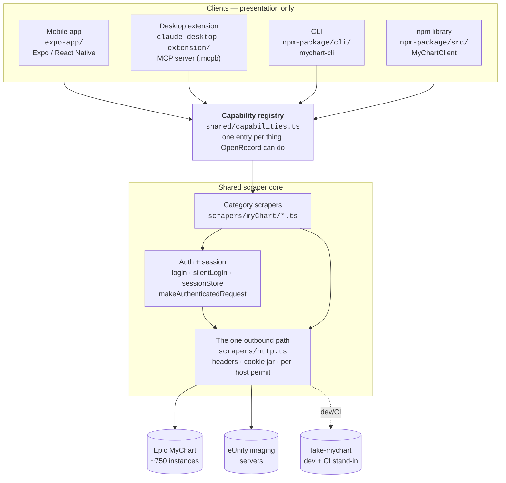
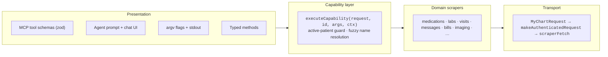

# Architecture

How this codebase is laid out, and why. Start here.

The one-sentence version: **one scraper core, one capability registry, four clients that
only own their own presentation.**

| Doc | Covers |
| --- | --- |
| [01 — Shared core](01-shared-core.md) | `scrapers/`, `shared/` — the HTTP path, sessions, auth, rate limiting |
| [02 — Capability registry](02-capability-registry.md) | `shared/capabilities.ts` and how each client derives its surface from it |
| [03 — Mobile app](03-expo-app.md) | `expo-app/` — Expo/React Native, on-device agent loop |
| [04 — Claude Desktop extension](04-desktop-extension.md) | `claude-desktop-extension/` — the `.mcpb` MCP server |
| [05 — CLI and npm package](05-cli-and-npm-package.md) | `npm-package/` — `mychart-cli` and the importable library |
| [06 — Supporting services](06-supporting-services.md) | `fake-mychart/`, the Lambdas, the splash site and browser demo |

Diagrams are [Mermaid](https://mermaid.js.org/) fenced blocks, which GitHub renders
inline — no image files to regenerate, and a diff to a diagram reads as a diff.

## The big picture

## The rules that shape it

Four constraints explain most of the structure. Each is enforced by a test, not by
convention — the build fails if one is broken.

| Rule | Why | Enforced by |
| --- | --- | --- |
| **One capability registry** | Four hand-maintained tool lists drifted to 46 / 43 / 46 / 38 entries, so a patient's answer depended on which client they asked | `shared/__tests__/capability-parity.unit.test.ts` |
| **One outbound HTTP path** | A second raw-`fetch` call site keeps working — it just isn't rate-limited, cookie-jarred, or sending browser headers | `scrapers/__tests__/http.unit.test.ts` greps `scrapers/` for network calls |
| **One authenticated-request wrapper** | MyChart answers an expired session with a redirect to the login page, which reads as "this patient has no allergies" unless something central catches it | `makeAuthenticatedRequest` is the only post-login transport |
| **Every test file names its suite** | A file without a `*.unit`/`*.integration`/`*.real-mychart` suffix silently never runs, and a suite that never runs looks exactly like one that passes | `tests/suite-naming.unit.test.ts` |

## Where the layers stop

The boundary that matters most: **nothing in `scrapers/` or `shared/` knows about MCP,
React Native, or `argv`.** A capability's `run()` takes a logged-in `MyChartRequest` and
returns JSON-serializable data. Everything above translates that into a tool schema, a
chat bubble, or stdout.

The one deliberate exception is `rendersMedia` — `download_imaging_study` returns raw CLO
bytes because each client encodes them differently (pure-JS `jpeg-js` in the extension, an
on-device decoder in the app, `sharp` in the CLI). Clients branch on that flag, never on
the capability id.

## Keeping this current

These docs describe structure, not line numbers, so they only go stale when the structure
changes. See the **Architecture Documentation** section of the root `CLAUDE.md` for the
rule on when a change has to update them.
