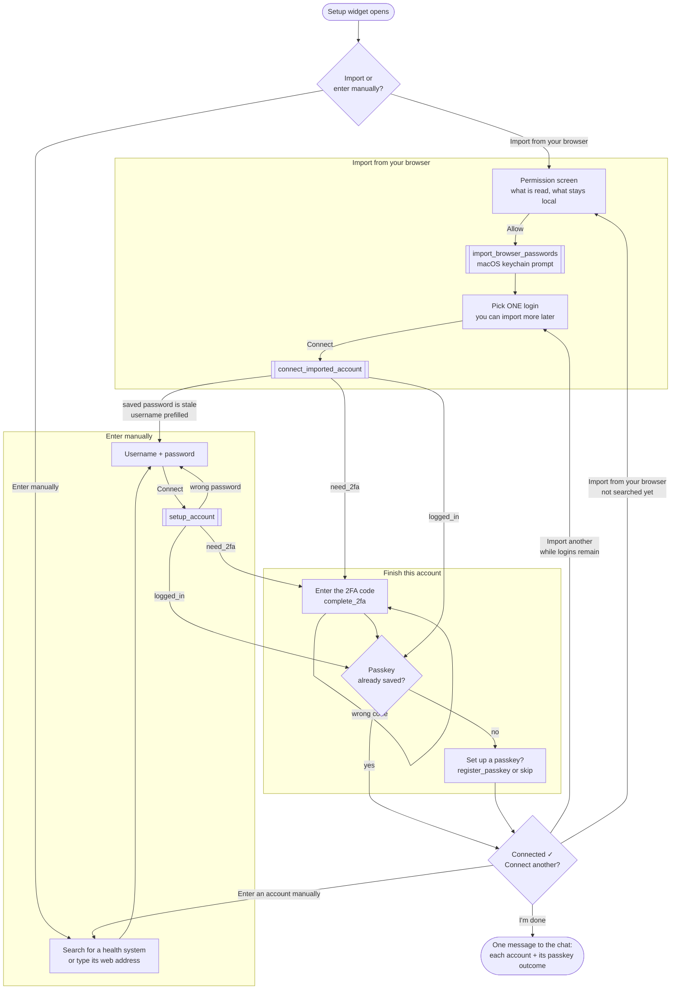

# MCPB setup widget: user flow

How a user connects MyChart accounts through the Claude Desktop extension's setup widget
(`get_setup_widget`, a React app in [`claude-desktop-extension/src/setup-widget/`](../claude-desktop-extension/src/setup-widget/);
the flow below is the reducer in `flow.ts`).

Accounts are connected **one at a time**. Nearly every portal asks for a 2FA code, so each
account runs to the end (sign-in, code, passkey offer) before the widget asks about the
next one. After every account the user lands on the same list, which offers another
import (while any are left), a manual sign-in, or **I'm done**.

## Notes

- **Back buttons.** From 2FA on an imported login, *Back* returns to the list (the pending
  login is dropped); on a manual login it returns to the username/password step. The
  sign-in step reached from a stale import goes back to the list, not the health-system search.
- **What the list offers.** A login connected in this widget leaves the list (it moves to the
  ✓ list above it). One already connected before, or saved without a username, is shown but
  can't be picked. When nothing pickable is left, the list disappears and **I'm done**
  becomes the main button.
- **Import ids expire** 10 minutes after the scan. If a long round of 2FA codes outlasts
  them, the list says so and offers *Import from your browser* again.
- **Passwords never reach the widget or Claude.** The widget handles only opaque import ids;
  `connect_imported_account` redeems one inside the server process.
- **Slow calls.** A call that outruns Claude Desktop's timeout comes back parked; the widget
  waits it out with `check_pending_call` (most likely the scan, sitting on the keychain prompt).
