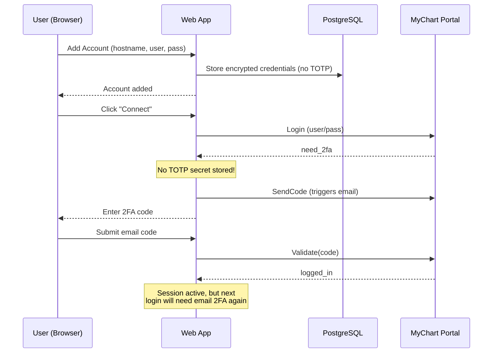
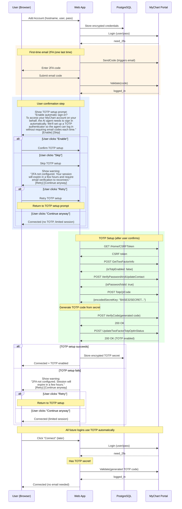
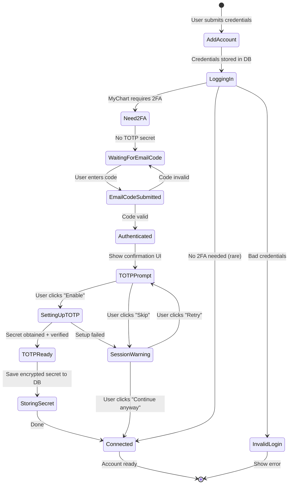
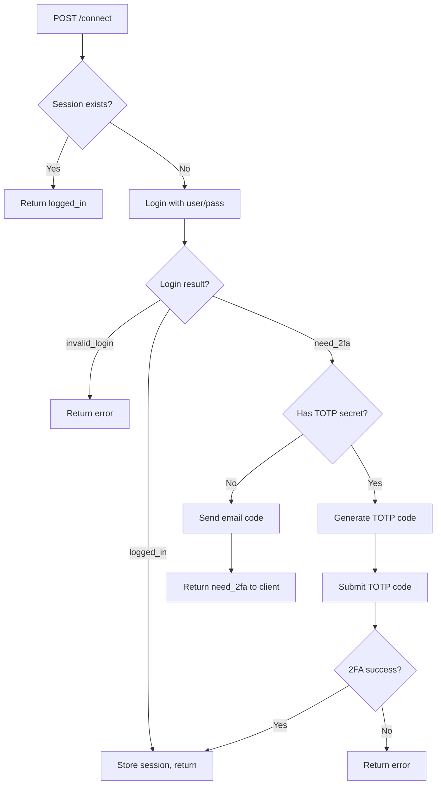
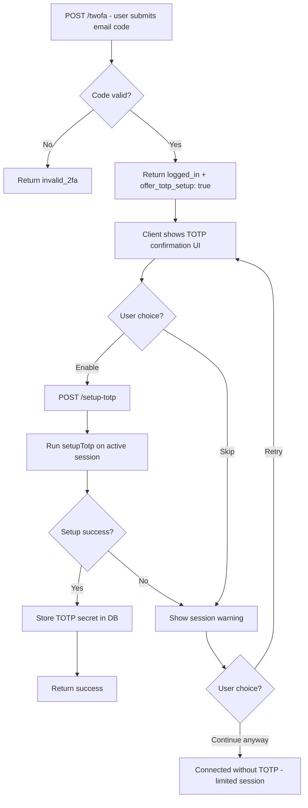

# Web App: Automatic TOTP Setup Flow

When a user adds a MyChart account through the web app, we set up TOTP after their first successful email 2FA so that all future logins are fully autonomous (no email codes needed). The user is shown a confirmation step before we enable TOTP on their MyChart account.

## Current Flow (Broken)



## Proposed Flow (TOTP Setup with User Confirmation)



## UI States



## TOTP Confirmation UI

After the email 2FA code is accepted, show a modal/card:

```
┌─────────────────────────────────────────────────┐
│  Enable automatic sign-in?                      │
│                                                 │
│  To access your MyChart account on your behalf, │
│  the AI agent needs to sign in automatically.   │
│  We'll set up a TOTP authenticator so the agent │
│  can log in without requiring email codes each  │
│  time.                                          │
│                                                 │
│  This adds an authenticator app to your MyChart │
│  security settings. You can disable it anytime  │
│  from your MyChart account.                     │
│                                                 │
│            [ Skip ]    [ Enable ]               │
└─────────────────────────────────────────────────┘
```

While TOTP setup is running (after user confirms):

```
┌─────────────────────────────────────────────────┐
│  Setting up automatic sign-in...                │
│                                                 │
│  ◠  Configuring your MyChart account            │
│                                                 │
│  This only takes a few seconds.                 │
└─────────────────────────────────────────────────┘
```

If user clicks "Skip" or TOTP setup fails, show a warning:

```
┌─────────────────────────────────────────────────┐
│  ⚠ 2FA not configured                          │
│                                                 │
│  Without automatic sign-in, your session will   │
│  only last a few hours. Once it expires, you'll │
│  need to log in again with email verification.  │
│                                                 │
│  The AI agent won't be able to reconnect to     │
│  your MyChart account automatically.            │
│                                                 │
│      [ Retry ]    [ Continue anyway ]           │
└─────────────────────────────────────────────────┘
```

## Connect Endpoint Changes





## Implementation Plan

### 1. Modify `POST /api/twofa` response
- After successful email 2FA, include `offer_totp_setup: true` in response (when instance has no TOTP secret)
- Client uses this flag to show the confirmation UI

### 2. New API endpoint: `POST /api/mychart-instances/:id/setup-totp`
- Called when user clicks "Enable" in the confirmation UI
- Uses the active MyChart session to run `setupTotp(mychartRequest, password)`
- Stores the encrypted TOTP secret in the DB via `updateMyChartInstance()`
- Returns success/failure

### 3. Client-side UI changes (`home/page.tsx`)
- New state: `showTotpPrompt` (shown after email 2FA succeeds with `offer_totp_setup`)
- Confirmation card with "Enable" / "Skip" buttons
- Loading state while TOTP setup runs
- On success: refresh instances list (now shows TOTP indicator)
- On skip/failure: show session warning with Retry / Continue anyway options
- "Continue anyway" proceeds as connected but with limited session lifetime

### 4. Connect endpoint
- Already handles TOTP correctly (line 42-57 in current code)
- No changes needed -- just needs a TOTP secret in the DB

### Key files to modify
- `web/src/app/api/twofa/route.ts` -- add `offer_totp_setup` to response
- `web/src/app/api/mychart-instances/[id]/setup-totp/route.ts` -- new endpoint
- `web/src/app/home/page.tsx` -- TOTP confirmation UI
- `web/src/lib/db.ts` -- may need `updateTotpSecret()` helper (or use existing `updateMyChartInstance`)
