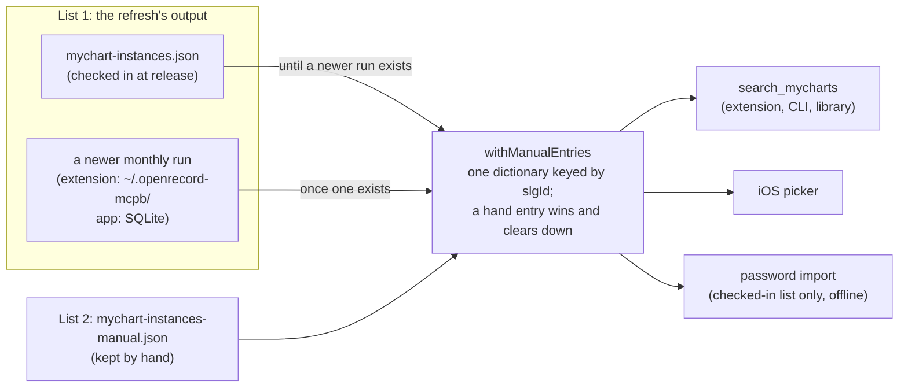
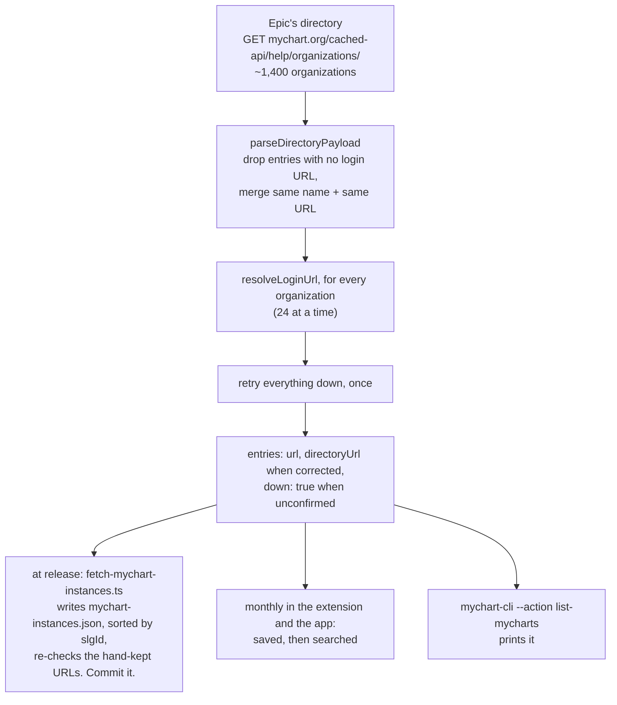
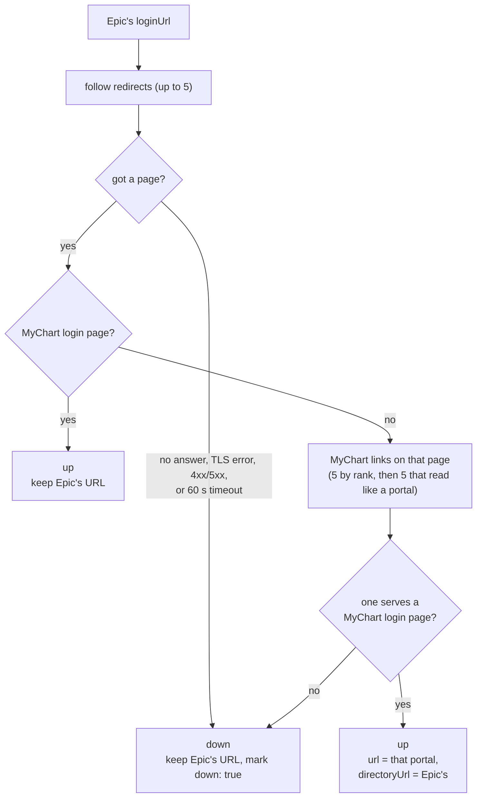

# How the MyChart list works

Every client searches the same thing: **two lists, merged**.

1. **The refresh's output**: Epic's directory with every login URL checked, produced by
   deterministic code. It's checked in as `mychart-instances.json` at each release, and the
   long-running clients rerun the same code monthly.
2. **`mychart-instances-manual.json`**: entries kept by hand, each with its source.

## The two lists, and who reads them

Search never makes a request. The CLI is one-shot, so it searches the checked-in list.

## The refresh: producing list 1

The same code runs at release and monthly. `fetchResolvedMyChartDirectory` in
`refreshDirectory.ts` does this:

## Checking one login URL

What `resolveLoginUrl` decides for each organization:

`down` means "we couldn't confirm it was up when we checked". That includes portals that work
fine for patients but not for us: custom sign-in pages (Kaiser, UPMC), sites that block traffic
from outside their country (several Dutch hospitals, an NHS trust), and servers missing an
intermediate certificate. A hand-kept entry clears it.

## Keeping the hand-kept list honest

- Every release refresh re-checks each hand-kept URL and prints the ones that stopped serving a
  login, and any addition Epic now lists itself.
- `directory.unit.test.ts` fails the build in these cases:
  - a hand entry names an `slgId` that doesn't exist
  - an addition's host is one Epic now lists
  - a URL isn't a mount root
  - either file isn't sorted by `slgId` with keys in order
- To add to it, see the `find-missing-mycharts` skill. The research behind the current entries
  is in [`LOGIN-URL-RESEARCH.md`](LOGIN-URL-RESEARCH.md).
