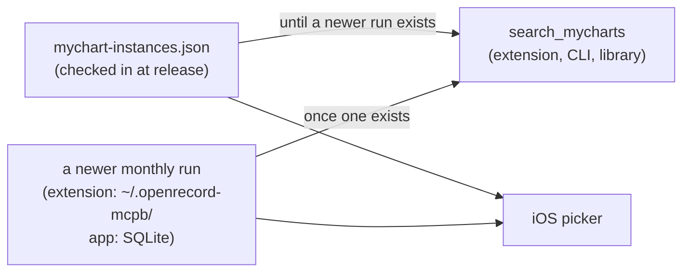
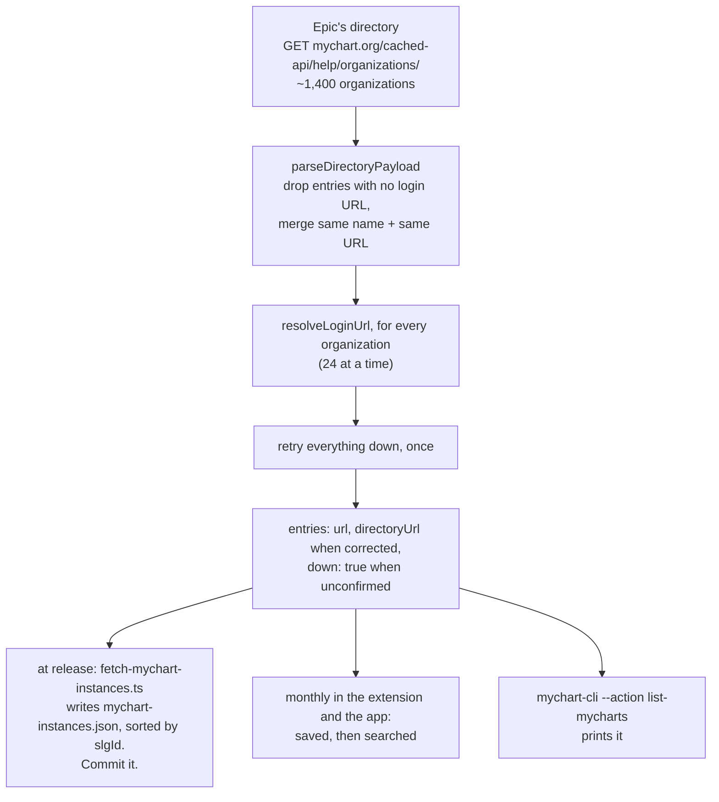
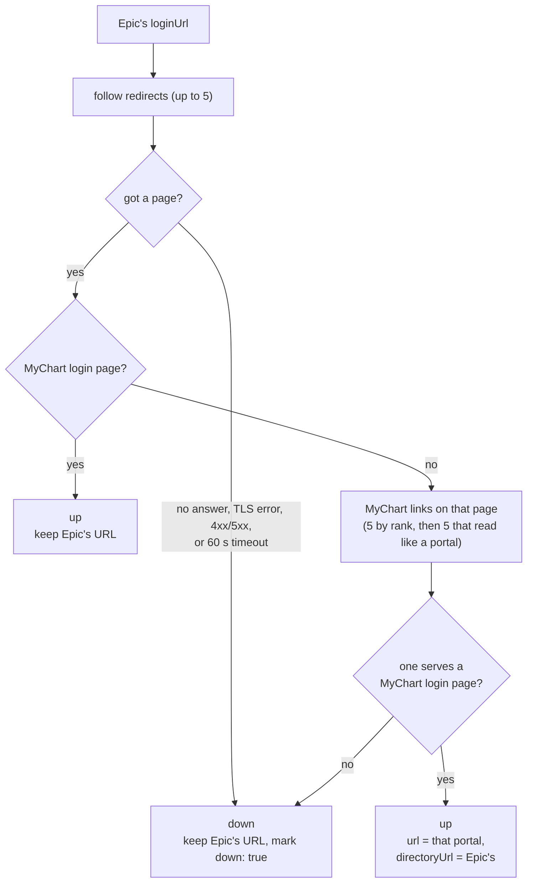

# How the MyChart list works

Every client searches the output of one piece of deterministic code: Epic's directory with every
login URL checked. It's checked in as `mychart-instances.json` at each release, and the
long-running clients rerun the same code monthly.

## Which run a client searches

Search never makes a request. The CLI is one-shot, so it searches the checked-in list.

## The refresh

The same code runs at release and monthly. `fetchResolvedMyChartDirectory` in
`refreshDirectory.ts` does this:

## Checking one login URL

What `resolveLoginUrl` decides for each organization:

`down` means "we couldn't confirm it was up when we checked". That includes portals that work
fine for patients but not for us: custom sign-in pages (Kaiser, UPMC), sites that block traffic
from outside their country (several Dutch hospitals, an NHS trust), and servers missing an
intermediate certificate.
